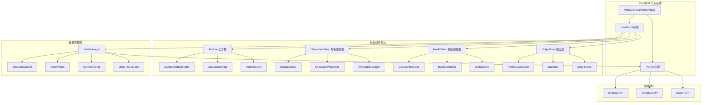
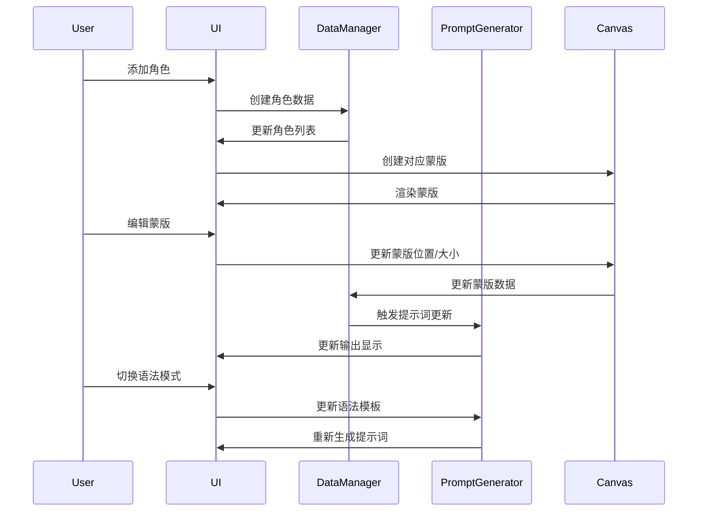
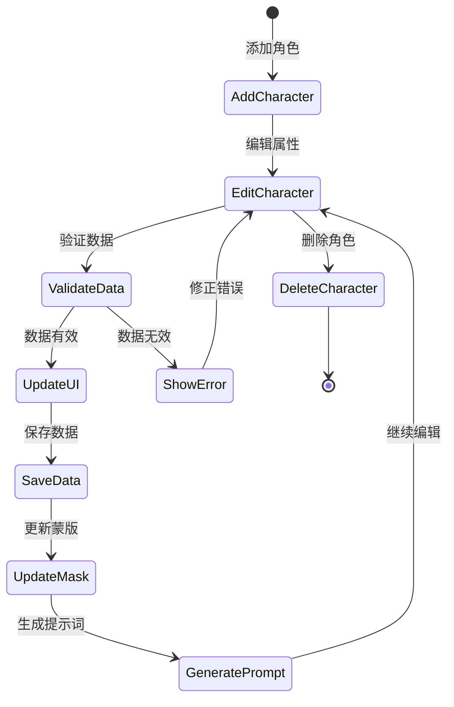
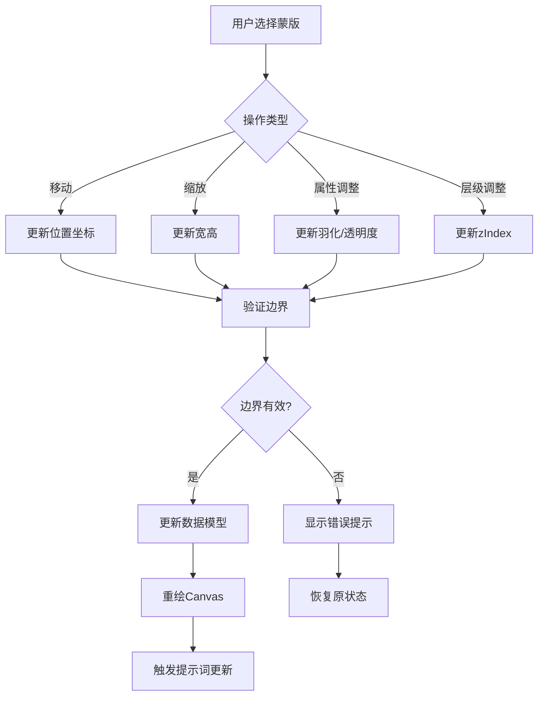
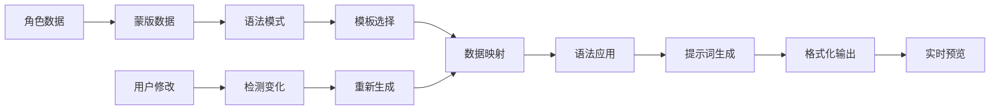
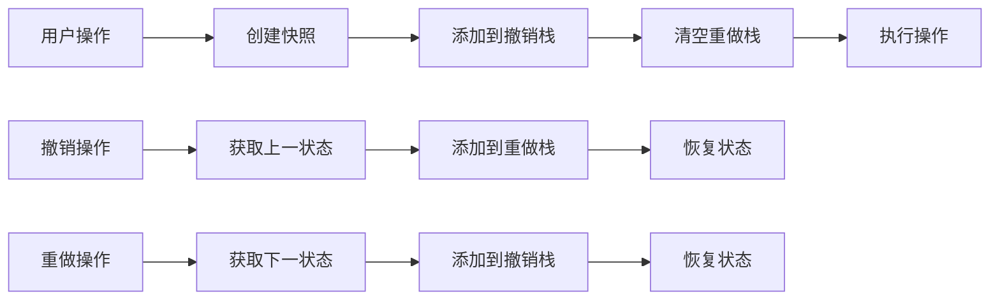
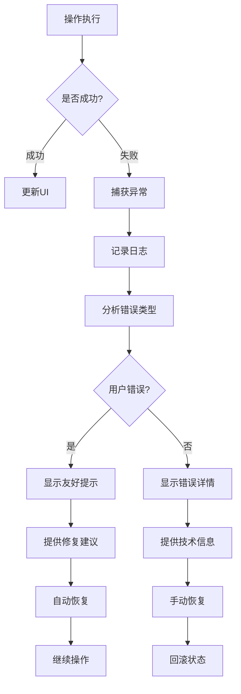
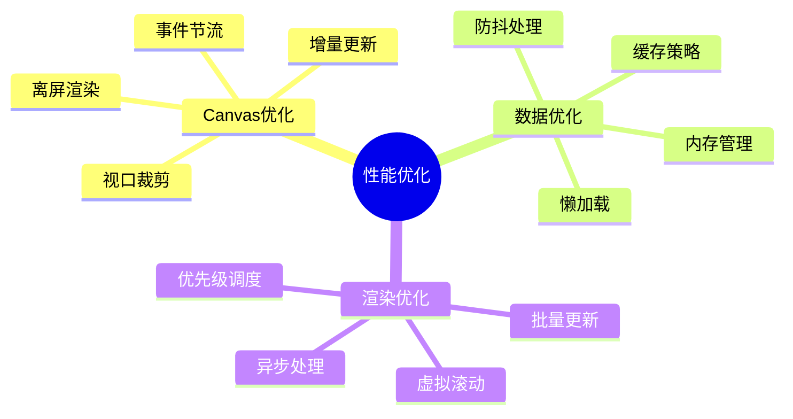

# 多人角色提示词编辑器 - 系统流程设计

## 1. 系统架构图



## 2. 数据流图



## 3. 角色管理流程



## 4. 蒙版编辑流程



## 5. 提示词生成流程



    UpdateUI --> [*]
    ShowError --> [*]
```

## 7. 撤销重做机制



## 8. 错误处理流程



## 9. 性能优化策略



## 10. 组件通信机制

```mermaid
sequenceDiagram
    participant Parent as 父组件
    participant Child1 as 子组件1
    participant Child2 as 子组件2
    participant Event as 事件总线
    
    Parent->>Child1: 传递props
    Child1->>Event: 发送事件
    Event->>Child2: 广播事件
    Child2->>Parent: 回调通知
    Parent->>Child2: 更新状态
    
    Note over Parent,Child2: 使用发布订阅模式实现组件解耦